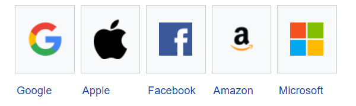

# Module 1 Introduction to BigData

BigData is something so huge and complex that it is impossible for traditional systems and traditional datawarehousing tools to process and work on them.

Data is generated by machines, humans and also by mother nature, with the growth of technologies and services, this large data is produce that can be structured, semi-structured and unstructured.

Bigdata can neither be worked upon by using traditional SQL nor can the relational database management system be used for storage, so that a wide variety of scalable database tools and techniques have evolved.

## Why use BigData

The need of big data comes from the Big Companies like (GAFAM) 

For the purpose of analysis of big amount of data which is in unstructured form. Such type of data is very difficult to process that contains the billions records of millions people information that includes images, audio and text.

## BigData five v's

Big data can be described by the following characteristics what we called the five V's of big data.

## Volume
The quantity of generated and stored data. The size of the data determines the value and potential insight, and whether it can be considered big data or not. The size of big data is usually larger than terabytes and petabytes

## Variety
The type and nature of the data. 
90% of data generated in unstructured form.

## Velocity
The speed at which the data is generated and processed to meet the demands and challenges.

## Veracity
The truthfulness or reliability of the data, which refers to the data quality and the data value.

When we are dealing with a high volume, velocity and variety of data, it is not possible that all of the data is going to be 100% correct there will be dirty data. The quality of the data being captured can vary greatly. The data accuracy of analysis depends on the veracity of the source data.

## Value
Value is the most important aspect in the big data.
It is all well and good having access to big data but unless we can turn it into value it is become useless.

Value may also represent the profitability of information that is retrieved from the analysis of big data.

## Technology

There are serval software product and availble technologies to facilitate big data analytics. Hadoop is the most commonly used technology used to handle big data.

## What is Hadoop

Hadoop, is an open source distributed data processing system, create by Doug Cutting and Mike Cafarella as a Apache Software.

The core of Apache Hadoop consists of a storage part, known as Hadoop Distributed File System (HDFS), and a processing part which is a MapReduce programming model.

## Apache Hadoop Framework
The base Apache Hadoop framework is composed of the following modules

### Hadoop Common
contains libraries and utilities needed by other Hadoop modules

### Hadoop Distributed File System(HDFS)

a distributed file-system that stores data on commodity machines, providing very high aggregate bandwidth across the cluster

### Hadoop Yet Another Resource Negotiator (YARN)

(introduced in 2012) a platform responsible for managing computing resources in clusters and using them for scheduling users' applications

### Hadoop MapReduce

an implementation of the MapReduce programming model for large-scale data processing.

