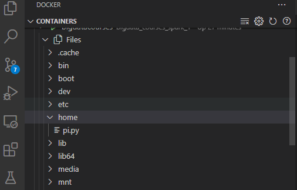

#  Module 2 Install Apache Spark and Apache Hadoop

There are many ways to install hadoop and spark on cluster, we chose to install spark in docker cluster.

## what is docker ?

Docker is a set of platform as a service products that use OS-level virtualization to deliver software in packages called containers. Containers are isolated from one another and bundle their own software, libraries and configuration files; they can communicate with each other through well-defined channels.

## What is docker-compose ?

Docker Compose is a tool for running multi-container applications on Docker defined using the Compose file format. A Compose file is used to define how the one or more containers that make up your application are configured.

### install docker

To install docker go to the link [https://www.docker.com/products/docker-desktop](https://www.docker.com/products/docker-desktop) and download docker binary .

Double-click Docker for Windows Installer to run the installer.

When the installation finishes, Docker starts automatically. The whale  in the notification area indicates that Docker is running, and accessible from a terminal.

Open a command-line terminal like PowerShell, and try out some Docker commands!

``` powershell
docker version

# Server: Docker Engine - Community
#  Engine:
#   Version:          20.10.8
#   API version:      1.41 (minimum version 1.12)
#   Go version:       go1.16.6
#   Git commit:       75249d8
#   Built:            Fri Jul 30 19:52:31 2021
#   OS/Arch:          linux/amd64
#   Experimental:     false
#  containerd:
#   Version:          1.4.9
#   GitCommit:        e25210fe30a0a703442421b0f60afac609f950a3
#  runc:
#   Version:          1.0.1
#   GitCommit:        v1.0.1-0-g4144b63
#  docker-init:
#   Version:          0.19.0
#   GitCommit:        de40ad0
```

## What is Spark ?

Apache Spark is a high-performance engine for large-scale computing tasks, such as data processing, machine learning and real-time data streaming. It includes APIs for Java, Python, Scala and R. [https://spark.apache.org/](https://spark.apache.org/)

### Create Docker Container

In this courses we use Bitnami Spark Docker Image  [https://hub.docker.com/r/bitnami/spark](https://hub.docker.com/r/bitnami/spark) 

### Why use Bitnami Images?

* Bitnami closely tracks upstream source changes and promptly publishes new versions of this image using our automated systems.
* With Bitnami images the latest bug fixes and features are available as soon as possible.
* Bitnami containers, virtual machines and cloud images use the same components and configuration approach - making it easy to switch between formats based on your project needs.
* All our images are based on minideb a minimalist Debian based container image which gives you a small base container image and the familiarity of a leading Linux distribution.
* All Bitnami images available in Docker Hub are signed with Docker Content Trust (DCT). You can use DOCKER_CONTENT_TRUST=1 to verify the integrity of the images.
* Bitnami container images are released daily with the latest distribution packages available.
* This CVE scan report contains a security report with all open CVEs. To get the list of actionable security issues, find the "latest" tag, click the vulnerability report link under the corresponding "Security scan" field and then select the "Only show fixable" filter on the next page.


### Create Dockerfile

* Create image from bitnami/spark
* Change user to root because binami image is a non root image
* Install numpy, pandas , pyarrow and py4j

``` docker
FROM bitnami/spark

USER root 
RUN pip install numpy pandas pyarrow py4j
USER 1001

```

### Create docker-compose file

* Download compose file form [bitnami source](https://raw.githubusercontent.com/bitnami/bitnami-docker-spark/master/docker-compose.yml) 

* Edit our compose file with three workers, every workers 1G ram and 1 core.

``` docker

version: '2'

services:
  spark:
    image: bigdatacourses
    environment:
      - SPARK_MODE=master
      - SPARK_RPC_AUTHENTICATION_ENABLED=no
      - SPARK_RPC_ENCRYPTION_ENABLED=no
      - SPARK_LOCAL_STORAGE_ENCRYPTION_ENABLED=no
      - SPARK_SSL_ENABLED=no
    ports:
      - '8080:8080'
  spark-worker-1:
    image: bigdatacourses
    environment:
      - SPARK_MODE=worker
      - SPARK_MASTER_URL=spark://spark:7077
      - SPARK_WORKER_MEMORY=1G
      - SPARK_WORKER_CORES=1
      - SPARK_RPC_AUTHENTICATION_ENABLED=no
      - SPARK_RPC_ENCRYPTION_ENABLED=no
      - SPARK_LOCAL_STORAGE_ENCRYPTION_ENABLED=no
      - SPARK_SSL_ENABLED=no
  spark-worker-2:
    image: bigdatacourses
    environment:
      - SPARK_MODE=worker
      - SPARK_MASTER_URL=spark://spark:7077
      - SPARK_WORKER_MEMORY=1G
      - SPARK_WORKER_CORES=1
      - SPARK_RPC_AUTHENTICATION_ENABLED=no
      - SPARK_RPC_ENCRYPTION_ENABLED=no
      - SPARK_LOCAL_STORAGE_ENCRYPTION_ENABLED=no
      - SPARK_SSL_ENABLED=no
  spark-worker-3:
    image: bigdatacourses
    environment:
      - SPARK_MODE=worker
      - SPARK_MASTER_URL=spark://spark:7077
      - SPARK_WORKER_MEMORY=1G
      - SPARK_WORKER_CORES=1
      - SPARK_RPC_AUTHENTICATION_ENABLED=no
      - SPARK_RPC_ENCRYPTION_ENABLED=no
      - SPARK_LOCAL_STORAGE_ENCRYPTION_ENABLED=no
      - SPARK_SSL_ENABLED=no

```

### Build and run Docker images with Compose


``` powershell
docker-compose up
```

### Create our first spark app

``` python

from time import time
import numpy as np
from random import random
from operator import add

from pyspark.sql import SparkSession


def naive_method_time(n):
    inside = 0

    t_0 = time()
    for _ in range(n):
        x, y = random(), random()
        if x**2 + y**2 < 1:
            inside += 1
    return(np.round(time()-t_0, 3))


def spark_method_time(n):

    def is_point_inside_unit_circle(p):
        x, y = random(), random()
        return 1 if x*x + y*y < 1 else 0

    t_0 = time()

    sc.parallelize(range(0, n)) .map(is_point_inside_unit_circle).reduce(add)
    return(np.round(time()-t_0, 3))


N = [10000, 50000, 100000, 500000, 1000000,
     5000000, 10000000, 50000000, 100000000]


time_native = []
time_spark = []

spark = SparkSession.builder.appName('CalculatePi').getOrCreate()
sc = spark.sparkContext

for n in N:
    time_native.append(naive_method_time(n))
    time_spark.append(spark_method_time(n))

print('time native', time_native)
print('time spark', time_spark)

```

Save our python script as 'pi.py'

### Run on Docker

First we need to copy our python script to docker image master with :

``` powershell
docker cp pi.py bigdata_courses_spark_1:/home/pi.py
```



Then enter to master Container and run the 'pi.py' script with:

``` powershell
spark-submit /home/pi.py
```


## What is Hadoop ?

see [Module 1](module_1.md)

### Create docker-composer file

1) Clone or download this repo [https://github.com/big-data-europe/docker-hadoop](https://github.com/big-data-europe/docker-hadoop)
2) Go to the docker-hadoop folder

``` powershell
cd docker-hadoop
```
3) Enter 'docker-compose up' in terminal
``` powershell
docker-compose up
```

### Create our first MapReduce app (wordcount)

``` java
import java.io.BufferedReader;
import java.io.FileReader;
import java.io.IOException;
import java.net.URI;
import java.util.ArrayList;
import java.util.HashSet;
import java.util.List;
import java.util.Set;
import java.util.StringTokenizer;

import org.apache.hadoop.conf.Configuration;
import org.apache.hadoop.fs.Path;
import org.apache.hadoop.io.IntWritable;
import org.apache.hadoop.io.Text;
import org.apache.hadoop.mapreduce.Job;
import org.apache.hadoop.mapreduce.Mapper;
import org.apache.hadoop.mapreduce.Reducer;
import org.apache.hadoop.mapreduce.lib.input.FileInputFormat;
import org.apache.hadoop.mapreduce.lib.output.FileOutputFormat;
import org.apache.hadoop.mapreduce.Counter;
import org.apache.hadoop.util.GenericOptionsParser;
import org.apache.hadoop.util.StringUtils;

public class WordCount {

  public static class TokenizerMapper
       extends Mapper<Object, Text, Text, IntWritable>{

    static enum CountersEnum { INPUT_WORDS }

    private final static IntWritable one = new IntWritable(1);
    private Text word = new Text();

    private boolean caseSensitive;
    private Set<String> patternsToSkip = new HashSet<String>();

    private Configuration conf;
    private BufferedReader fis;

    @Override
    public void setup(Context context) throws IOException,
        InterruptedException {
      conf = context.getConfiguration();
      caseSensitive = conf.getBoolean("wordcount.case.sensitive", true);
      if (conf.getBoolean("wordcount.skip.patterns", false)) {
        URI[] patternsURIs = Job.getInstance(conf).getCacheFiles();
        for (URI patternsURI : patternsURIs) {
          Path patternsPath = new Path(patternsURI.getPath());
          String patternsFileName = patternsPath.getName().toString();
          parseSkipFile(patternsFileName);
        }
      }
    }

    private void parseSkipFile(String fileName) {
      try {
        fis = new BufferedReader(new FileReader(fileName));
        String pattern = null;
        while ((pattern = fis.readLine()) != null) {
          patternsToSkip.add(pattern);
        }
      } catch (IOException ioe) {
        System.err.println("Caught exception while parsing the cached file '"
            + StringUtils.stringifyException(ioe));
      }
    }

    @Override
    public void map(Object key, Text value, Context context
                    ) throws IOException, InterruptedException {
      String line = (caseSensitive) ?
          value.toString() : value.toString().toLowerCase();
      for (String pattern : patternsToSkip) {
        line = line.replaceAll(pattern, "");
      }
      StringTokenizer itr = new StringTokenizer(line);
      while (itr.hasMoreTokens()) {
        word.set(itr.nextToken());
        context.write(word, one);
        Counter counter = context.getCounter(CountersEnum.class.getName(),
            CountersEnum.INPUT_WORDS.toString());
        counter.increment(1);
      }
    }
  }

  public static class IntSumReducer
       extends Reducer<Text,IntWritable,Text,IntWritable> {
    private IntWritable result = new IntWritable();

    public void reduce(Text key, Iterable<IntWritable> values,
                       Context context
                       ) throws IOException, InterruptedException {
      int sum = 0;
      for (IntWritable val : values) {
        sum += val.get();
      }
      result.set(sum);
      context.write(key, result);
    }
  }

  public static void main(String[] args) throws Exception {
    Configuration conf = new Configuration();
    GenericOptionsParser optionParser = new GenericOptionsParser(conf, args);
    String[] remainingArgs = optionParser.getRemainingArgs();
    if ((remainingArgs.length != 2) && (remainingArgs.length != 4)) {
      System.err.println("Usage: wordcount <in> <out> [-skip skipPatternFile]");
      System.exit(2);
    }
    Job job = Job.getInstance(conf, "word count");
    job.setJarByClass(WordCount.class);
    job.setMapperClass(TokenizerMapper.class);
    job.setCombinerClass(IntSumReducer.class);
    job.setReducerClass(IntSumReducer.class);
    job.setOutputKeyClass(Text.class);
    job.setOutputValueClass(IntWritable.class);

    List<String> otherArgs = new ArrayList<String>();
    for (int i=0; i < remainingArgs.length; ++i) {
      if ("-skip".equals(remainingArgs[i])) {
        job.addCacheFile(new Path(remainingArgs[++i]).toUri());
        job.getConfiguration().setBoolean("wordcount.skip.patterns", true);
      } else {
        otherArgs.add(remainingArgs[i]);
      }
    }
    FileInputFormat.addInputPath(job, new Path(otherArgs.get(0)));
    FileOutputFormat.setOutputPath(job, new Path(otherArgs.get(1)));

    System.exit(job.waitForCompletion(true) ? 0 : 1);
  }
}
```
Save file 'WordCount.java'

Open datanode cli and create inputs files

``` bash

# go to the home directory
cd /home

# create inputs files
echo 'this is my new file i put it on hdfs cluster' >> input0

echo 'hello my name is hadoop and I am a big data system' >> input1

echo 'hello for the second time my name is hadoop' >> input2

#show files
ls 

## >> input0  input1  input2

# create hdfs directory

hdfs dfs -mkdir /home
hdfs dfs  -mkdir /home/input

# put the input files in hdfs

hdfs dfs -put input0 /home/input/input0
hdfs dfs -put input1 /home/input/input1
hdfs dfs -put input2 /home/input/input2

# check the files in hdfs

hdfs dfs -ls /home/input

## -rw-r--r-- 3 root supergroup 45 2021-10-09 23:27 /home/input/input0
## -rw-r--r-- 3 root supergroup 51 2021-10-09 23:27 /home/input/input1
## -rw-r--r-- 3 root supergroup 44 2021-10-09 23:27 /home/input/input2


# open host terminal
# copy Wordcount.java to /home/

cd

# open namenode cli
# go to /home directory
cd /home


# compile WordCount.java
/

# show files

ls

# >> WordCount$IntSumReducer.class
# >> WordCount$TokenizerMapper.class
# >> WordCount.java
# >> WordCount$TokenizerMapper$CountersEnum.class
# >> WordCount.class

# create jar wc.jar

jar cf wc.jar  *.class

# run hadoop app

hadoop jar wc.jar WordCount /home/input /home/output


## check the result
hdfs dfs -ls /home/output
# -rw-r--r-- 3 root supergroup 0 2021-10-10 00:11 /home/output/_SUCCESS
# -rw-r--r-- 3 root supergroup 160 2021-10-10 00:11 /home/output/part-r-00000

# print the result

hdfs dfs -cat /home/output/part-r-00000

# I       1
# a       1
# am      1
# and     1
# big     1
# cluster 1
# data    1
# file    1
# for     1
# hadoop  2
# hdfs    1
# hello   2
# i       1
# is      3
# it      1
# my      3
# name    2
# new     1
# on      1
# put     1
# second  1
# system  1
# the     1
# this    1
# time    1
```


