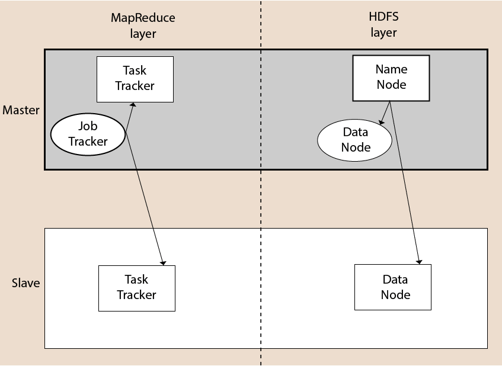

# Module 3 Hadoop architecture

## What is hadoop ?

see [Module 1](module_1.md)

## Hadoop Architecture

The Hadoop architecture is a package of the file system, MapReduce engine and the HDFS (Hadoop Distributed File System). The MapReduce engine can be MapReduce/MR1 or YARN/MR2.

In our case we use YARN/MP2 (Yet Another Resource Negotiator).

A Hadoop cluster consists of a single master and multiple slave nodes. The master node includes Job Tracker, Task Tracker, NameNode, and DataNode whereas the slave node includes DataNode and TaskTracker.

## Hadoop Distributed File System (HDFS)

The Hadoop Distributed File System (HDFS) is a distributed file system for Hadoop. It contains a master/slave architecture. This architecture consist of a single NameNode performs the role of master, and multiple DataNodes performs the role of a slave.

In our case we have a Container NAMENODE => master and one Container DATANODE => slave.

### NameNode

* It is a single master server exist in the HDFS cluster.
* As it is a single node, it may become the reason of single point failure.
* It manages the file system namespace by executing an operation like the opening, renaming and closing the files.
* It simplifies the architecture of the system.

### DataNode

* The HDFS cluster contains multiple DataNodes.
* Each DataNode contains multiple data blocks.
* These data blocks are used to store data.
* It is the responsibility of DataNode to read and write requests from the file system's clients.
* It performs block creation, deletion, and replication upon instruction from the NameNode.

## Yet Another Resource Negotiator (YARN)

The fundamental idea of YARN is to split up the functionalities of resource management and job scheduling/monitoring into separate daemons. The idea is to have a global ResourceManager (RM) and per-application ApplicationMaster (AM). An application is either a single job or a DAG of jobs.

The ResourceManager and the NodeManager form the data-computation framework. The ResourceManager is the ultimate authority that arbitrates resources among all the applications in the system. The NodeManager is the per-machine framework agent who is responsible for containers, monitoring their resource usage (cpu, memory, disk, network) and reporting the same to the ResourceManager/Scheduler.

The per-application ApplicationMaster is, in effect, a framework specific library and is tasked with negotiating resources from the ResourceManager and working with the NodeManager(s) to execute and monitor the tasks.

### ResourceManager
The ResourceManager has two main components: Scheduler and ApplicationsManager.

The Scheduler is responsible for allocating resources to the various running applications subject to familiar constraints of capacities, queues etc.

The ApplicationsManager is responsible for accepting job-submissions, negotiating the first container for executing the application specific ApplicationMaster and provides the service for restarting the ApplicationMaster container on failure.

In order to scale YARN beyond few thousands nodes, YARN supports the notion of Federation via the YARN Federation feature. Federation allows to transparently wire together multiple yarn (sub-)clusters, and make them appear as a single massive cluster.

OSS YARN has been known to scale up to about few thousand nodes. The proposed architecture leverages the notion of federating a number of such smaller YARN clusters, referred to as sub-clusters, into a larger federated YARN cluster comprising of tens of thousands of nodes. The applications running in this federated environment see a unified large YARN cluster and will be able to schedule tasks on any nodes in the cluster. Under the hood, the federation system will negotiate with sub-clusters RMs and provide resources to the application. The logical architecture in Figure 1 shows the main components that comprise the federated cluster, which are described below.

## MapReduce

The MapReduce comes into existence when the client application submits the MapReduce job to Job Tracker. In response, the Job Tracker sends the request to the appropriate Task Trackers. Sometimes, the TaskTracker fails or time out. In such a case, that part of the job is rescheduled.

### Job Tracker

* The role of Job Tracker is to accept the MapReduce jobs from client and process the data by using NameNode.
* In response, NameNode provides metadata to Job Tracker.

### Task Tracker
* It works as a slave node for Job Tracker.
* It receives task and code from Job Tracker and applies that code on the file. This process can also be called as a Mapper.

### JobHistory
JobTracker or ResourceManager keeps all job information in memory. For finished jobs, it drops them to avoid running out of memory. Tracking of these past jobs are delegated to JobHistory server.

## Hadoop start mode
You can start your Hadoop cluster in one of the three supported modes:

* Local (Standalone) Mode
* Pseudo-Distributed Mode
* Fully-Distributed Mode

### Standalone
By default, Hadoop is configured to run in a non-distributed mode, as a single Java process. This is useful for debugging.

### Pseudo-Distributed
Hadoop can also be run on a single-node in a pseudo-distributed mode where each Hadoop daemon runs in a separate Java process.

### Fully-Distributed
Hadoop can also be run on cluster (multi-nodes) from a few nodes to extremely large clusters with thousands of nodes.

## useful link for our hadoop cluster on docker

Just change <dockerhadoop_IP_address> with localhost or your machine ip

* Namenode: http://<dockerhadoop_IP_address>:9870/dfshealth.html#tab-overview
* History server: http://<dockerhadoop_IP_address>:8188/applicationhistory
* Datanode: http://<dockerhadoop_IP_address>:9864/
* Nodemanager: http://<dockerhadoop_IP_address>:8042/node
* Resource manager: http://<dockerhadoop_IP_address>:8088/