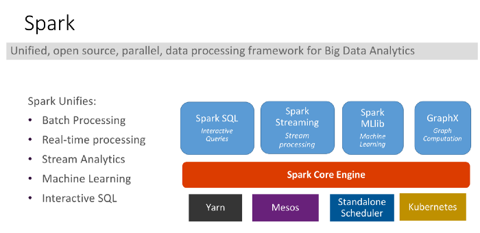

# Module 4 Spark architecture

## What is Spark ?

see [Module 2](module_2.md)

## Spark Architecture

The Spark architecture is a package of Spark SQL, Spark Streaming, Spark MLlib and GraphX .

Spark supports multiple widely-used programming languages (Python, Java, Scala, and R), includes libraries for diverse tasks ranging from SQL to streaming and machine learning, and Spark runs anywhere from a laptop to a cluster of thousands of servers. This makes it an easy system to start with and scale-up to big data processing or an incredibly large scale.

## The Architecture of a Spark Application

Below are the high-level components of the architecture of the Apache Spark application:

### The Spark driver

The driver is the process “in the driver seat” of your Spark Application. It is the controller of the execution of a Spark Application and maintains all of the states of the Spark cluster (the state and tasks of the executors). It must interface with the cluster manager in order to actually get physical resources and launch executors.

### The Spark executors

Spark executors are the processes that perform the tasks assigned by the Spark driver. Executors have one core responsibility: take the tasks assigned by the driver, run them, and report back their state (success or failure) and results. Each Spark Application has its own separate executor processes.

### The cluster manager

The Spark Driver and Executors do not exist in a void, and this is where the cluster manager comes in. The cluster manager is responsible for maintaining a cluster of machines that will run your Spark Application(s). Somewhat confusingly, a cluster manager will have its own “driver” (sometimes called master) and “worker” abstractions.

The core difference is that these are tied to physical machines rather than processes (as they are in Spark). The machine on the left of the illustration is the Cluster Manager Driver Node. The circles represent daemon processes running on and managing each of the individual worker nodes. There is no Spark Application running as of yet—these are just the processes from the cluster manager.

When the time comes to actually run a Spark Application, we request resources from the cluster manager to run it. Depending on how our application is configured, this can include a place to run the Spark driver or might be just resources for the executors for our Spark Application. Over the course of Spark Application execution, the cluster manager will be responsible for managing the underlying machines that our application is running on.

## Cluster Manager types

The system currently supports several cluster managers:

* Standalone – a simple cluster manager included with Spark that makes it easy to set up a cluster.
* Apache Mesos – a general cluster manager that can also run Hadoop MapReduce and service applications.
* Hadoop YARN – the resource manager in Hadoop 2.
* Kubernetes – an open-source system for automating deployment, scaling, and management of containerized applications.

## Execution Modes

An execution mode gives you the power to determine where the aforementioned resources are physically located when you go running your application. You have three modes to choose from:

1) Cluster mode
2) Client mode
3) Local mode

### Cluster mode

Cluster mode is probably the most common way of running Spark Applications. In cluster mode, a user submits a pre-compiled JAR, Python script, or R script to a cluster manager. The cluster manager then launches the driver process on a worker node inside the cluster, in addition to the executor processes. This means that the cluster manager is responsible for maintaining all Spark Application– related processes.

### Client mode

Client mode is nearly the same as cluster mode except that the Spark driver remains on the client machine that submitted the application. This means that the client machine is responsible for maintaining the Spark driver process, and the cluster manager maintains the executor processes. These machines are commonly referred to as gateway machines or edge nodes.

### Local mode

Local mode is a significant departure from the previous two modes: it runs the entire Spark Application on a single machine. It achieves parallelism through threads on that single machine. This is a common way to learn Spark, to test your applications, or experiment iteratively with local development.

However, we do not recommend using local mode for running production applications.

## Glossary

* Application : User program built on Spark. Consists of a driver program and executors on the cluster.
* Driver program : The process running the main() function of the application and creating the SparkContext
* Cluster manager : An external service for acquiring resources on the cluster (e.g. standalone manager, Mesos, YARN
* Deploy mode : Distinguishes where the driver process runs. In "cluster" mode, the framework launches the driver inside of the cluster. In "client" mode, the submitter launches the driver outside of the cluster.
* Worker node : Any node that can run application code in the cluster
* Task : A unit of work that will be sent to one executor
* Job : A parallel computation consisting of multiple tasks that gets spawned in response to a Spark action (e.g. save, collect); you'll see this term used in the driver's logs.
* Stage : Each job gets divided into smaller sets of tasks called stages that depend on each other (similar to the map and reduce stages in MapReduce); you'll see this term used in the driver's logs.